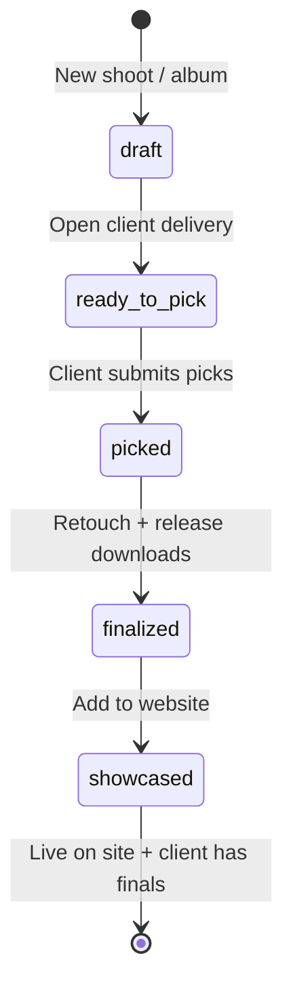

# Vega — product definition

**Vega** is the photographer's **website manager** — it runs your portfolio site, keeps you in creative control, and handles the shoot-to-showcase loop so every job updates both your clients' deliverables and your public work.

| What Vega is | What Vega is not |
|--------------|------------------|
| Your site, your direction — Vega publishes and maintains it | A generic drag-and-drop site builder |
| A manager that handles delivery *for* you | A separate "gallery app" bolted onto a website |
| One album model: private delivery → public showcase | Two disconnected products |

Hosted at **https://vega.menhir-holdings.com**. Published portfolios: `{slug}.vega.menhir-holdings.com` or custom domain.

---

## Product hierarchy

```
┌─────────────────────────────────────────────────────────┐
│  YOUR WEBSITE (primary — creative control retained)      │
│  Hero · galleries · about · contact · publish           │
└───────────────────────────┬─────────────────────────────┘
                            │ each completed shoot feeds in
┌───────────────────────────▼─────────────────────────────┐
│  ALBUMS (shoots)                                         │
│  Upload → curate → client delivery → retouch → showcase  │
└───────────────────────────┬─────────────────────────────┘
                            │ culminates in
              ┌─────────────┴─────────────┐
              ▼                           ▼
     Client delivered album        New work on your site
     (same link, picks → finals)   (gallery section + picks)
```

**Client delivery** is a feature inside the album workflow — not the product center. It exists to complete the shoot and surface the best images back to your portfolio.

---

## Core loop (shoot → site)



### 1. Website (ongoing)

Photographer's home in Vega is **their site** — what's live, what needs a publish, recent shoots waiting to go public.

- Edit copy, hero, about, contact in the **site editor** (controller + live preview)
- Assign album sections to the page structure
- **Publish** when ready — Vega handles deployment to your URL
- Creative direction stays with the photographer; Vega handles plumbing

### 2. New shoot (album)

After a session, create an album and upload a batch (files, folder, or ZIP).

- Curate: what the **client** sees vs what might later hit the **site**
- Client delivery: share one link, optional PIN, pick limit
- Client picks on mobile; photographer retouches and releases finals
- **Showcase**: choose which images from this shoot join your portfolio — one action adds a gallery section and marks site-visible assets

### 3. Culmination (two outcomes, one workflow)

| Outcome | Who | What |
|---------|-----|------|
| **Delivered album** | Client | Same link: picks → wait → ZIP download of finals |
| **New showcase** | Photographer's site | Gallery section (or update) with selected finals; site republish optional |

Private albums never appear on the public site until the photographer explicitly showcases them.

---

## Visibility model

| Toggle | Client delivery | Public website |
|--------|-----------------|----------------|
| Client only | ✓ | — |
| Site only | — | ✓ |
| Both | ✓ (during delivery) | ✓ (after showcase) |
| Neither | Hidden | Hidden |

Showcase step sets `visibleOnSite` on chosen assets and registers the album in site sections.

---

## Taxonomy

```
Workspace (photographer)
├── Site (slug, sections, hero, publish state)     ← primary object
├── Albums (shoots)
│   ├── Categories · Assets · DeliverySession
│   └── showcasedAt (when added to site)
└── PublishedSite (deploy target, custom domain)
```

**Album delivery states:** `draft` → `ready_to_pick` → `picked` → `finalized` → showcased (album.showcasedAt set)

---

## URLs

| Role | URL |
|------|-----|
| Product + admin | `https://vega.menhir-holdings.com` |
| **Site home** | `/admin` |
| Site editor | `/admin/site` |
| Albums (shoots) | `/admin/albums` |
| Album workflow | `/admin/albums/{id}` |
| Client delivery | `/deliver/{token}` |
| Published site | `/s/{slug}` |

---

## Pricing direction

- **Student:** subdomain portfolio, limited storage, delivery per event
- **Pro:** custom domain, unlimited albums, automatic showcase sections
- Site management is the anchor; delivery is included value

---

## Implementation status (2026-07-06)

- ✅ Website-first admin home (`/admin`) with site status + publish
- ✅ Site editor at `/admin/site` (controller + preview)
- ✅ Album workflow: ingest → curate → deliver → retouch → showcase
- ✅ Showcase API — add album gallery to site, mark site-visible assets
- ✅ Client delivery (pick link, lightbox, review, ZIP)
- ✅ Blob media + auth scaffold + event bus
- ⏳ Clerk auth · Resend notifications · custom domain · multi-gallery site renderer polish

See [UX.md](./UX.md) · [SYSTEM.md](./SYSTEM.md)
