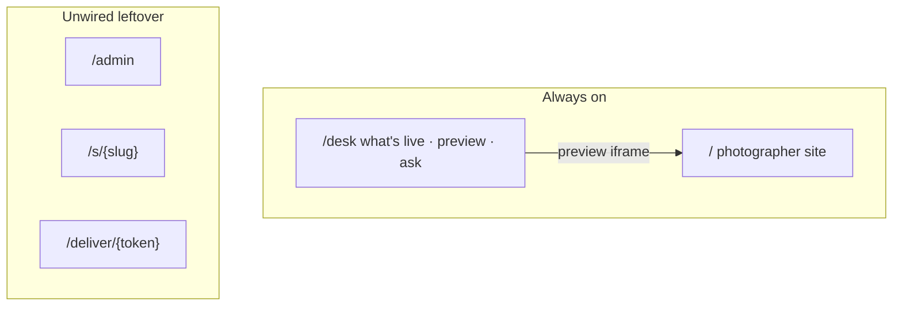

# Vega — system design

**Vega is a photographer website plus a quiet desk.** Canonical host: `vega-menhir-holdings.vercel.app`. Album/admin machinery may still exist in-tree; it is not the default `/`.

---

## Topology



---

## Layer responsibilities

| Layer | Path | Role |
|-------|------|------|
| **Middleware** | `src/middleware.ts` | Auth gate on `/admin/*`; public delivery + site bypass |
| **Auth** | `src/lib/auth/` | Session/workspace guard; Clerk-ready interface |
| **Store** | `src/lib/store/` | Workspace JSON — albums, sessions, picks, site config |
| **Media** | `src/lib/storage/` | Blob upload/delete; proof vs final URLs |
| **Events** | `src/lib/events/` | Domain events → notification adapters (email later) |
| **Delivery** | `src/lib/delivery.ts` | State labels, URL helpers |
| **API** | `src/app/api/` | REST-ish routes; thin handlers, fat lib |

---

## Data model

Single JSON document per workspace (v1). Media URLs point to Blob, not embedded base64.

```typescript
VegaStore {
  workspace: Workspace          // owner, slug, plan
  albums: Album[]             // assets inline (URLs only)
  deliverySessions: DeliverySession[]
  picks: Record<sessionId, ClientPickSubmission>
  site: SiteBuilderConfig
}
```

### Album delivery state machine

```
draft ──[open delivery]──► ready_to_pick ──[client picks]──► picked
picked ──[retouch + release]──► finalized ──[showcase]──► showcased (album.showcasedAt)
```

Showcase calls `addAlbumToSiteShowcase()` — sets `visibleOnSite`, appends gallery section, republishes site.

### Media asset URLs

| Field | Resolution | Audience |
|-------|------------|----------|
| `previewUrl` | ~1600px JPEG | Client gallery, site |
| `originalUrl` | Full upload | Photographer reference |
| `finalUrl` | Retouched full-res | Client download when finalized |

Blob path: `media/{workspaceId}/{albumId}/{assetId}/{variant}.jpg`

---

## API surface

### Workspace (auth required)

| Method | Route | Purpose |
|--------|-------|---------|
| GET | `/api/workspace` | Dashboard summary |
| GET/POST | `/api/albums` | List / create |
| GET/PATCH/DELETE | `/api/albums/{id}` | Album CRUD + reorder |
| POST | `/api/albums/{id}/assets` | Batch upload → Blob |
| PATCH/DELETE | `/api/albums/{id}/assets/{assetId}` | Visibility, category, order |
| POST | `/api/albums/{id}/assets/{assetId}/final` | Upload retouched final |
| GET/POST | `/api/albums/{id}/delivery` | Session + PIN + email |
| PATCH | `/api/albums/{id}/categories` | Category CRUD |
| POST | `/api/albums/{id}/showcase` | Add shoot to site — culmination |
| GET/PUT | `/api/site` | Builder config + publish |

### Client (public, token-gated)

| Method | Route | Purpose |
|--------|-------|---------|
| GET | `/api/deliver/{token}` | Gallery payload (+ PIN) |
| POST | `/api/deliver/{token}/picks` | Submit selection |
| GET | `/api/deliver/{token}/download` | ZIP of finals |

### Public site

| Method | Route | Purpose |
|--------|-------|---------|
| GET | `/api/site/{slug}` | Published site JSON |
| GET | `/s/{slug}` | SSR portfolio page |

---

## Auth (infrastructure block)

**v1:** `VEGA_AUTH_DISABLED=true` in dev; production uses workspace owner check.

**v2 (Clerk):** Install `@clerk/nextjs`, map `userId` → `workspace.ownerId`.

```
src/lib/auth/
  config.ts     — mode: disabled | dev-owner | clerk
  guard.ts      — requireAuth(), getWorkspaceId()
  clerk.ts      — (stub) Clerk provider wiring
```

Middleware protects `/admin` and `/api/albums`, `/api/site`, `/api/workspace` write paths. Delivery and public site remain open.

---

## Storage (infrastructure block)

```
src/lib/storage/
  media.ts      — putMedia(), deleteMedia(), mediaPath()
  proof.ts      — clientPreviewUrl() — same as preview for v1
```

Upload flow:

1. Client compresses images (`compress-image.ts`).
2. API receives base64 or multipart.
3. `putMedia()` writes original + preview variants to Blob.
4. Store holds URLs only.

Fallback: if `BLOB_READ_WRITE_TOKEN` unset, dev stores data URLs (existing behavior).

---

## Events (infrastructure block)

```
src/lib/events/
  types.ts      — VegaEvent union
  emit.ts       — emit(event) → console + future Resend
```

| Event | Trigger | Future channel |
|-------|---------|----------------|
| `delivery.opened` | State → `ready_to_pick` | — |
| `picks.submitted` | Client POST picks | Email to photographer |
| `finals.released` | State → `finalized` | Email to client with link |
| `storage.warning` | Usage > 80% | Email to photographer |

Handlers are no-ops until `RESEND_API_KEY` is set.

---

## Deployment

| Env var | Required | Purpose |
|---------|----------|---------|
| `BLOB_READ_WRITE_TOKEN` | Production | Store JSON + media blobs |
| `VEGA_AUTH_DISABLED` | Dev only | Skip auth locally |
| `CLERK_SECRET_KEY` | Phase 2 | Multi-tenant auth |
| `RESEND_API_KEY` | Phase 2 | Transactional email |

Domain: [https://vega-menhir-holdings.vercel.app](https://vega-menhir-holdings.vercel.app) (see [DNS.md](./DNS.md)). Unpaid `.com` is not canonical. Photographer subdomains are not in this skeleton.

---

## Migration path (JSON → Postgres)

When multi-tenant auth ships:

1. `workspaces` table keyed by `owner_id`.
2. `albums`, `assets`, `delivery_sessions` normalized.
3. Blob paths unchanged.
4. One-time import script from `vega-store.json`.

Until then, single-workspace JSON + Blob is sufficient for first paying photographer.

---

## File map (implementation)

| Concern | Files |
|---------|-------|
| UX spec | `docs/UX.md` |
| System design | `docs/SYSTEM.md` (this file) |
| Auth | `src/lib/auth/*`, `src/middleware.ts` |
| Media | `src/lib/storage/*` |
| Events | `src/lib/events/*` |
| Photographer UI | `src/components/admin/*` |
| Client UI | `src/components/deliver/*` |
| Env template | `.env.example` |
